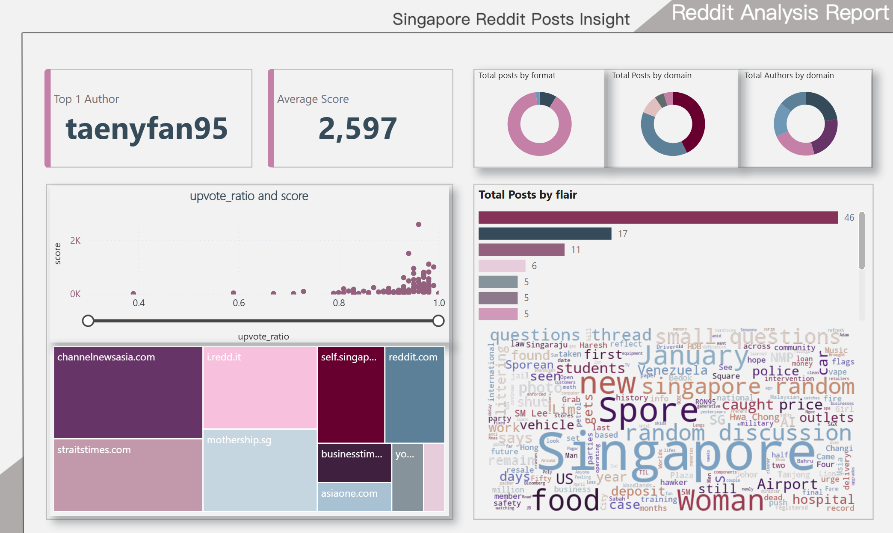

# Reddit Data Pipeline - ETL Lakehouse Project

A comprehensive data engineering project that implements a modern data lakehouse architecture for ingesting, processing, and analyzing Reddit posts using Apache Airflow, PySpark, Delta Lake, and Great Expectations.

## Table of Contents

1. [Project Overview](#project-overview)
2. [Architecture](#architecture)
3. [Data Flow](#data-flow)
4. [Technology Stack](#technology-stack)
5. [Project Structure](#project-structure)
6. [Key Components](#key-components)
7. [Table Structure](#table-structure)
8. [Apache Airflow Highlights](#apache-airflow-highlights)
9. [Great Expectations Highlights](#great-expectations-highlights)
10. [Getting Started](#getting-started)
11. [Best Practices Implemented](#best-practices-implemented)

---

## Project Overview

This project implements an end-to-end data pipeline that:
- **Extracts** Reddit posts via web scraping
- **Transforms** raw data through Bronze → Silver → Gold medallion architecture
- **Loads** processed data into a Delta Lake-based lakehouse
- **Validates** data quality using Great Expectations at ingestion
- **Orchestrates** all workflows using Apache Airflow

### Architecture Diagram


### Dashboard Sample



---

## Data Flow

### Overview
The pipeline follows a **medallion architecture** pattern with three layers of data quality and refinement:

```
Raw CSV Files → Bronze Layer → Silver Layer → Gold Layer
    (Landing)   (Validated)    (Cleaned)      (Curated)
```

### Detailed Flow

#### 1. **Data Extraction (Scrapy)**
- **Location**: `include/scrapy.ipynb`
- **Process**: Scrapes Reddit posts from Singapore subreddit (`r/singapore`)
- **Output**: CSV files stored in `include/data/` with timestamp
- **Fields**: post_id, title, author, score, upvote_ratio, comments, flair, is_video, is_self, domain, url, created_utc, selftext, extracted_time

#### 2. **Bronze Layer (Raw + Validated)**
- **Location**: `include/pyspark/bronze.py`
- **Process**:
  - Reads CSV files via Spark Structured Streaming
  - Applies schema validation
  - **Great Expectations validation** at batch level
  - Quarantines failing rows to `data_quality_quarantine` table
  - Appends validated data to Delta Lake table `reddit_posts_bz`
- **Key Features**:
  - Stream processing with micro-batches
  - Automatic schema enforcement
  - Data quality gates before ingestion
  - Checkpoint management for exactly-once semantics

#### 3. **Silver Layer (Cleaned & Transformed)**
- **Location**: `include/pyspark/silver.py`
- **Process**:
  - Reads from Bronze layer via Delta Streaming
  - Data type casting (boolean conversions, timestamp parsing)
  - **CDC (Change Data Capture)** enabled
  - **Upsert operations** using MERGE statements
  - Updates only when key metrics change (score, comments, upvote_ratio)
- **Key Features**:
  - Incremental processing via Delta Change Feed
  - Deduplication within micro-batches
  - Optimized MERGE with conditional updates
  - Table: `reddit_posts_sl`

#### 4. **Gold Layer (Curated Star Schema)**
- **Location**: `include/pyspark/gold.py`
- **Process**:
  - Reads CDC changes from Silver layer
  - Creates star schema model:
    - **Fact Table**: `fact_posts_gl` (all post attributes)
    - **Dimension Tables**: 
      - `dim_authors_gl` (author dimension)
      - `dim_flairs_gl` (flair dimension)
      - `dim_domains_gl` (domain dimension)
  - Business logic: Format classification (text/video/others)
- **Key Features**:
  - Normalized data model for analytics
  - Separate fact and dimension tables
  - CDC-based incremental updates

---

## Technology Stack

### Core Technologies

#### **Apache Airflow** ✈️
- **Version**: Astronomer Runtime 12.6.0
- **Purpose**: Workflow orchestration and scheduling
- **Key Features**:
  - **DAG**: `reddit_etl_pipeline` scheduled daily at 8:00 AM SGT
  - **Tasks**:
    1. `run_scrapy_notebook`: Executes web scraping via Papermill
    2. `run_spark_etl_notebook`: Runs complete ETL pipeline (Bronze→Silver→Gold)
  - **Timezone**: Asia/Singapore
  - **Retry Policy**: 1 retry with 5-minute delay
  - **Execution Timeout**: 10 min (scrapy), 20 min (spark)

#### **Apache Spark** 🔥
- **Version**: 3.5.3
- **Purpose**: Distributed data processing engine
- **Key Features**:
  - Structured Streaming for real-time processing
  - Spark SQL for transformations
  - Scheduler pools for resource isolation
  - Adaptive query execution (AQE)

#### **Delta Lake** 🏔️
- **Version**: 3.2.1
- **Purpose**: ACID transactions and time travel on data lakes
- **Key Features**:
  - **ACID Transactions**: Ensures data consistency
  - **Change Data Feed (CDC)**: Tracks row-level changes
  - **Schema Evolution**: Handles schema changes gracefully
  - **Time Travel**: Query historical versions
  - **Optimize & Z-Order**: Performance optimization utilities

#### **Great Expectations** ✅
- **Version**: 1.0.0
- **Purpose**: Data quality validation framework
- **Implementation**: `include/pyspark/great_expectations_common.py`
- **Key Features**:
  - **Expectation Suites**: Pre-defined validation rules stored in JSON
  - **Batch Validation**: Validates each micro-batch during ingestion
  - **Quarantine System**: Automatically isolates failing rows
  - **Result Format**: COMPLETE with unexpected index columns
  - **Integration**: Validates data before Delta Lake write
  - **Config Location**: `include/pyspark/gx_configs/expectations/`

**Validation Flow**:
```
Micro-batch → Load Expectation Suite → Run Validations → 
  ├─ Pass → Write to Delta Lake
  └─ Fail → Quarantine to data_quality_quarantine table
```

#### **MinIO** 🗄️
- **Purpose**: S3-compatible object storage (lakehouse storage layer)
- **Protocol**: S3A for Spark, S3 for Trino
- **Features**:
  - Checkpoint storage for stream processing
  - Delta Lake table storage
  - Data versioning and retention

#### **Trino** ⚡
- **Purpose**: Distributed SQL query engine
- **Catalog**: Delta catalog for querying Delta Lake tables
- **Use Case**: Analytics queries on lakehouse data

#### **Papermill** 📓
- **Purpose**: Parameterize and execute Jupyter notebooks
- **Integration**: Airflow executes notebooks via Papermill
- **Output**: Execution logs and output notebooks

---

## Project Structure

```
airflow-02-reddit-project/
├── dags/
│   └── reddit_elt_dag.py          # Airflow DAG definition
├── include/
│   ├── data/                       # Raw CSV files from scraping
│   ├── scrapy.ipynb               # Web scraping notebook
│   └── pyspark/
│       ├── bronze.py              # Bronze layer implementation
│       ├── silver.py              # Silver layer implementation
│       ├── gold.py                # Gold layer implementation
│       ├── spark_common.py        # Spark session manager
│       ├── setup.py               # Lakehouse setup & table creation
│       ├── great_expectations_common.py  # GX validation logic
│       ├── run.ipynb              # Main ETL execution notebook
│       └── gx_configs/            # Great Expectations configurations
│           └── expectations/      # Expectation suite JSON files
├── Dockerfile                     # Airflow runtime image
├── requirements.txt               # Python dependencies
└── README.md                      # This file
```

---

## Key Components

### 1. Airflow DAG (`dags/reddit_elt_dag.py`)
- Orchestrates the complete pipeline
- Scheduled execution with timezone support
- Error handling and retry mechanisms

### 2. Bronze Layer (`include/pyspark/bronze.py`)
- **Class**: `Bronze`
- **Method**: `consume_reddit_posts_bz()`
- **Features**:
  - CSV schema definition
  - Recursive file lookup
  - Great Expectations integration per batch
  - Stream-to-Delta append mode

### 3. Silver Layer (`include/pyspark/silver.py`)
- **Class**: `Silver`
- **Method**: `upsert_reddit_posts_sl()`
- **Features**:
  - Delta Change Feed consumption
  - Type casting and transformation
  - MERGE operations with conditional updates
  - Deduplication logic

### 4. Gold Layer (`include/pyspark/gold.py`)
- **Class**: `Gold`
- **Method**: `upsert_gold_layers()`
- **Features**:
  - Star schema construction
  - Fact and dimension table management
  - Format classification logic
  - CDCUpserter for row-level deduplication

### 5. Great Expectations (`include/pyspark/great_expectations_common.py`)
- **Function**: `validate_and_insert_process_batch()`
- **Features**:
  - Ephemeral context for Spark DataFrame validation
  - Suite caching for performance
  - Quarantine table for failed rows
  - Thread-safe validation execution

### 6. Lakehouse Setup (`include/pyspark/setup.py`)
- **Class**: `LakehouseSetupManager`
- **Methods**:
  - `setup()`: Creates database and Delta tables
  - `cleanup()`: Removes all tables and data
  - `validate()`: Verifies table existence
- **Tables Created**:
  - Bronze: `reddit_posts_bz`
  - Silver: `reddit_posts_sl` (CDC enabled)
  - Gold: `fact_posts_gl`, `dim_authors_gl`, `dim_flairs_gl`, `dim_domains_gl`
  - Quarantine: `data_quality_quarantine`

---

## Apache Airflow Highlights

### DAG Configuration
- **ID**: `reddit_etl_pipeline`
- **Schedule**: `0 8 * * *` (Daily at 8:00 AM SGT)
- **Timezone**: Asia/Singapore
- **Catchup**: Disabled (no backfills)
- **Tags**: reddit, spark, lakehouse

### Task Dependencies
```
run_scrapy_notebook → run_spark_etl_notebook
```

### Execution Environment
- **Runtime**: Astronomer Astro Runtime 12.6.0
- **Base Image**: `quay.io/astronomer/astro-runtime:12.6.0`
- **Java**: OpenJDK 17 (required for Spark)
- **Python Path**: Includes `/usr/local/airflow/include/pyspark`

### Container Components
1. **Postgres**: Airflow metadata database
2. **Scheduler**: Monitors and triggers tasks
3. **DAG Processor**: Parses DAG files
4. **API Server**: Serves Airflow UI (http://localhost:8080)
5. **Triggerer**: Handles deferred tasks

---

## Great Expectations Highlights

### Architecture
- **Mode**: Ephemeral context (no persistent filesystem dependency)
- **Integration**: Spark DataFrame validation
- **Suite Format**: JSON-based expectation suites

### Validation Process
1. **Load Suite**: Retrieves expectation suite from JSON file
2. **Create Data Source**: Registers Spark DataFrame as data source
3. **Run Validation**: Executes all expectations on micro-batch
4. **Handle Results**:
   - **Success**: Append to Delta table
   - **Failure**: 
     - Extract failing row IDs
     - Write to quarantine table with violated rules
     - Continue with passing rows

### Quarantine System
- **Table**: `data_quality_quarantine`
- **Schema**:
  - `table_name`: Source table name
  - `gx_batch_id`: Batch identifier
  - `violated_rules`: Concatenated list of failed expectations
  - `raw_data`: JSON representation of failed row
  - `ingestion_time`: Timestamp of quarantine

### Expectation Suite Location
- **Path**: `include/pyspark/gx_configs/expectations/`
- **Example**: `reddit_posts_bz_suite.json`
- **Usage**: Loaded at runtime and cached in memory

### Performance Optimizations
- **Suite Caching**: Pre-loaded JSON suites in memory
- **Thread Safety**: RLock for concurrent validations
- **Resource Cleanup**: Explicit garbage collection after validation

---

## Getting Started

### Prerequisites
- Docker & Docker Compose
- Python 3.8+
- Astronomer CLI (optional, for Astro deployment)

### Local Setup

1. **Clone Repository**
   ```bash
   git clone <repository-url>
   cd airflow-02-reddit-project
   ```

2. **Install Dependencies**
   ```bash
   pip install -r requirements.txt
   ```

3. **Start Airflow** (using Astronomer CLI)
   ```bash
   astro dev start
   ```
   Or using Docker Compose:
   ```bash
   docker-compose up -d
   ```

4. **Access Airflow UI**
   - URL: http://localhost:8080
   - Default credentials: `admin` / `admin`

5. **Configure Environment Variables**
   - Create `.env` file with MinIO credentials:
     ```
     AWS_ENDPOINT_URL=http://minio:9000
     AWS_ACCESS_KEY_ID=admin
     AWS_SECRET_ACCESS_KEY=admin_password
     MINIO_BUCKET=reddit-warehouse
     ```

6. **Initialize Lakehouse** (via notebook)
   - Execute `include/pyspark/00_main.ipynb` to set up tables

7. **Trigger DAG**
   - Navigate to Airflow UI → DAGs → `reddit_etl_pipeline`
   - Toggle ON and trigger manually or wait for scheduled run

### Development Workflow

1. **Local Testing**: Run notebooks directly in Jupyter
2. **DAG Development**: Modify `dags/reddit_elt_dag.py`
3. **Layer Development**: Update bronze/silver/gold modules
4. **Validation Rules**: Edit expectation suites in `gx_configs/expectations/`

---

## Table Structure

This section documents all tables in the lakehouse with their columns, data types, and descriptions.

### Database: `reddit_db`

The lakehouse uses a medallion architecture with three layers: Bronze (raw/validated), Silver (cleaned/transformed), and Gold (curated/aggregated).

---

### Bronze Layer Tables

#### `reddit_posts_bz`

**Purpose**: Raw data landing zone with validation. Stores Reddit posts as they are ingested from CSV files, with Great Expectations validation applied.

**Storage Format**: Delta Lake  
**Location**: `s3a://{bucket}/reddit_db/reddit_posts_bz`  
**Primary Key**: `post_id` (logical)

| Column Name | Data Type | Nullable | Description |
|------------|-----------|----------|-------------|
| `post_id` | STRING | No | Unique identifier for Reddit post (e.g., submission ID) |
| `title` | STRING | Yes | Post title |
| `author` | STRING | Yes | Reddit username of post author |
| `score` | INT | Yes | Net upvotes/downvotes score |
| `upvote_ratio` | DOUBLE | Yes | Ratio of upvotes to total votes (0.0-1.0) |
| `comments` | INT | Yes | Number of comments on the post |
| `flair` | STRING | Yes | Post flair/tag category |
| `is_video` | STRING | Yes | Whether post contains video (raw string: "True"/"False") |
| `is_self` | STRING | Yes | Whether post is a self-post (raw string: "True"/"False") |
| `domain` | STRING | Yes | Domain of linked content (e.g., "self.singapore", "youtube.com") |
| `url` | STRING | Yes | Full URL of the post or linked content |
| `created_utc` | STRING | Yes | Post creation timestamp in UTC (format: "yyyy-MM-dd HH:mm:ss") |
| `selftext` | STRING | Yes | Post body text content (for self-posts) |
| `extracted_time` | TIMESTAMP | Yes | Timestamp when data was scraped/extracted |
| `load_time` | TIMESTAMP | Yes | Timestamp when data was loaded into Bronze layer |

**Key Characteristics**:
- Data stored as-is from CSV files (minimal transformation)
- String types for boolean fields (`is_video`, `is_self`) and timestamps (`created_utc`)
- Great Expectations validation applied before insert
- Failed rows quarantined to `data_quality_quarantine` table

---

### Silver Layer Tables

#### `reddit_posts_sl`

**Purpose**: Cleaned and transformed data layer. Applies data type conversions, normalization, and CDC tracking.

**Storage Format**: Delta Lake (with CDC enabled)  
**Location**: `s3a://{bucket}/reddit_db/reddit_posts_sl`  
**Primary Key**: `post_id` (logical)  
**Change Data Capture**: Enabled (`delta.enableChangeDataFeed = true`)

| Column Name | Data Type | Nullable | Description |
|------------|-----------|----------|-------------|
| `post_id` | STRING | No | Unique identifier for Reddit post |
| `title` | STRING | Yes | Post title |
| `author` | STRING | Yes | Reddit username of post author |
| `score` | INT | Yes | Net upvotes/downvotes score |
| `upvote_ratio` | DOUBLE | Yes | Ratio of upvotes to total votes (0.0-1.0) |
| `comments` | INT | Yes | Number of comments on the post |
| `flair` | STRING | Yes | Post flair/tag category |
| `is_video` | BOOLEAN | Yes | Whether post contains video (converted from STRING) |
| `is_self` | BOOLEAN | Yes | Whether post is a self-post (converted from STRING) |
| `domain` | STRING | Yes | Domain of linked content |
| `url` | STRING | Yes | Full URL of the post or linked content |
| `created_utc` | TIMESTAMP | Yes | Post creation timestamp (converted from STRING) |
| `selftext` | STRING | Yes | Post body text content |
| `extracted_time` | TIMESTAMP | Yes | Timestamp when data was scraped/extracted |
| `load_time` | TIMESTAMP | Yes | Timestamp when data was loaded into Bronze layer |
| `update_time` | TIMESTAMP | Yes | Timestamp when row was last updated in Silver layer |

**Key Characteristics**:
- Type conversions: `is_video`/`is_self` → BOOLEAN, `created_utc` → TIMESTAMP
- CDC enabled for downstream processing (Gold layer consumption)
- Upsert operations using MERGE statements
- Updates only when key metrics change: `score`, `comments`, or `upvote_ratio`
- Deduplication within micro-batches

**MERGE Logic**:
```sql
MERGE INTO reddit_posts_sl a
USING reddit_posts_sl_delta b
ON a.post_id = b.post_id
WHEN MATCHED AND (
    a.score != b.score OR 
    a.comments != b.comments OR 
    a.upvote_ratio != b.upvote_ratio
) THEN UPDATE SET *
WHEN NOT MATCHED THEN INSERT *
```

---

### Gold Layer Tables

The Gold layer implements a **star schema** pattern with one fact table and three dimension tables.

#### `fact_posts_gl` (Fact Table)

**Purpose**: Central fact table containing post metrics and attributes. Designed for analytics and reporting.

**Storage Format**: Delta Lake  
**Location**: `s3a://{bucket}/reddit_db/fact_posts_gl`  
**Primary Key**: `post_id` (logical)  
**Foreign Keys**: `author` → `dim_authors_gl.author`, `flair` → `dim_flairs_gl.flair`, `domain` → `dim_domains_gl.domain`

| Column Name | Data Type | Nullable | Description |
|------------|-----------|----------|-------------|
| `post_id` | STRING | No | Unique identifier for Reddit post (primary key) |
| `title` | STRING | Yes | Post title |
| `author` | STRING | Yes | Reddit username (foreign key to `dim_authors_gl`) |
| `score` | INT | Yes | Net upvotes/downvotes score |
| `upvote_ratio` | DOUBLE | Yes | Ratio of upvotes to total votes (0.0-1.0) |
| `comments` | INT | Yes | Number of comments on the post |
| `flair` | STRING | Yes | Post flair category (foreign key to `dim_flairs_gl`) |
| `domain` | STRING | Yes | Domain of linked content (foreign key to `dim_domains_gl`) |
| `format` | STRING | Yes | Post format classification: "text" (self-post), "video", or "Others" |
| `url` | STRING | Yes | Full URL of the post or linked content |
| `created_utc` | TIMESTAMP | Yes | Post creation timestamp |
| `selftext` | STRING | Yes | Post body text content |
| `extracted_time` | TIMESTAMP | Yes | Timestamp when data was scraped/extracted |
| `update_time` | TIMESTAMP | Yes | Timestamp when row was last updated |

**Key Characteristics**:
- Derived column: `format` (business logic applied)
- Normalized references to dimension tables
- CDC-based incremental updates from Silver layer
- Deduplication by `post_id` and `extracted_time`

**Format Classification Logic**:
```python
format = 
  CASE 
    WHEN is_self = True THEN 'text'
    WHEN is_video = True THEN 'video'
    ELSE 'Others'
  END
```

#### `dim_authors_gl` (Dimension Table)

**Purpose**: Dimension table for Reddit authors/users.

**Storage Format**: Delta Lake  
**Location**: `s3a://{bucket}/reddit_db/dim_authors_gl`  
**Primary Key**: `author` (logical)

| Column Name | Data Type | Nullable | Description |
|------------|-----------|----------|-------------|
| `author` | STRING | No | Reddit username (primary key) |
| `update_time` | TIMESTAMP | Yes | Timestamp when dimension record was last updated |

**Key Characteristics**:
- Unique constraint on `author`
- Updated incrementally from fact table changes

#### `dim_flairs_gl` (Dimension Table)

**Purpose**: Dimension table for post flairs/categories.

**Storage Format**: Delta Lake  
**Location**: `s3a://{bucket}/reddit_db/dim_flairs_gl`  
**Primary Key**: `flair` (logical)

| Column Name | Data Type | Nullable | Description |
|------------|-----------|----------|-------------|
| `flair` | STRING | No | Post flair category (primary key) |
| `update_time` | TIMESTAMP | Yes | Timestamp when dimension record was last updated |

**Key Characteristics**:
- Unique constraint on `flair`
- Updated incrementally from fact table changes

#### `dim_domains_gl` (Dimension Table)

**Purpose**: Dimension table for content domains.

**Storage Format**: Delta Lake  
**Location**: `s3a://{bucket}/reddit_db/dim_domains_gl`  
**Primary Key**: `domain` (logical)

| Column Name | Data Type | Nullable | Description |
|------------|-----------|----------|-------------|
| `domain` | STRING | No | Content domain (primary key, e.g., "self.singapore", "youtube.com") |
| `update_time` | TIMESTAMP | Yes | Timestamp when dimension record was last updated |

**Key Characteristics**:
- Unique constraint on `domain`
- Updated incrementally from fact table changes

---

### Data Quality Tables

#### `data_quality_quarantine`

**Purpose**: Quarantine table for rows that fail Great Expectations validation. Stores failed data with violation details for investigation and reprocessing.

**Storage Format**: Delta Lake  
**Location**: `s3a://{bucket}/reddit_db/data_quality_quarantine`  
**Partitioning**: By `table_name` and `ingestion_time` (logical)

| Column Name | Data Type | Nullable | Description |
|------------|-----------|----------|-------------|
| `table_name` | STRING | No | Source table name where validation failed (e.g., "reddit_posts_bz") |
| `gx_batch_id` | STRING | No | Great Expectations batch identifier for the failed batch |
| `violated_rules` | STRING | Yes | Concatenated list of failed expectation rules (semicolon-separated) |
| `raw_data` | STRING | Yes | JSON representation of the entire failed row |
| `ingestion_time` | TIMESTAMP | Yes | Timestamp when the row was quarantined |

**Key Characteristics**:
- Stores complete row data as JSON in `raw_data` column
- Tracks which validation rules were violated
- Enables data recovery and reprocessing
- Used for data quality monitoring and alerting

**Example Violated Rules**:
- `[post_id] expect_column_values_to_be_unique`
- `[score] expect_column_values_to_not_be_null`
- `[upvote_ratio] expect_column_values_to_be_between`

---

## Best Practices Implemented

1. **Idempotency**: All operations support re-runs without data duplication
2. **Exactly-Once Processing**: Checkpoint-based stream processing
3. **Data Quality Gates**: Validation before ingestion
4. **Incremental Processing**: CDC-based updates minimize reprocessing
5. **Resource Isolation**: Scheduler pools for concurrent streams
6. **Error Handling**: Comprehensive try-catch with quarantine system
7. **Schema Evolution**: Delta Lake handles schema changes
8. **Monitoring**: Airflow provides task execution monitoring
